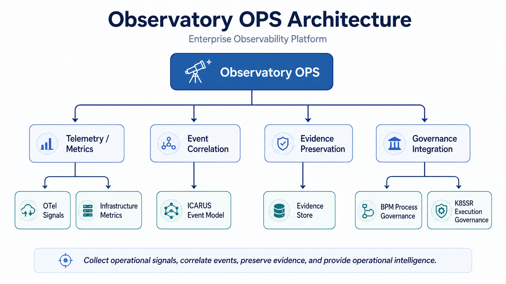
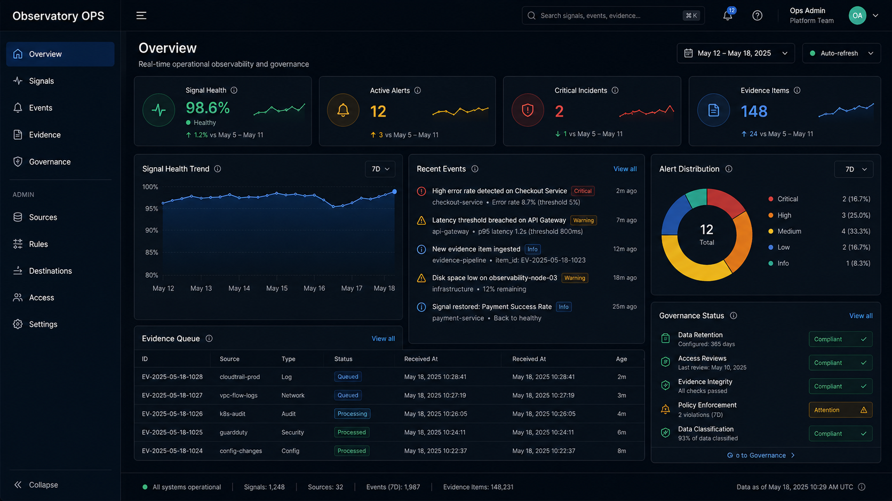

# Observatory OPS

## Enterprise Observability Platform

**Observatory OPS** is an operational intelligence platform designed to collect operational signals, correlate events, preserve evidence, and provide operational visibility across the ENYRAX engineering ecosystem.

### Purpose

- Collect operational signals
- Correlate operational events
- Preserve operational evidence
- Provide operational intelligence
- Integrate observability with governance workflows

---

## Platform Overview

```text
                Observatory OPS
                       |
        +--------------+--------------+
        |              |              |
    Metrics        Events        Evidence
        |              |              |
  Prometheus       ICARUS       Evidence Store
        |
    Dashboard
        |
    Portal / BI
```

Observatory OPS acts as the operational visibility layer above monitoring, event correlation, evidence preservation, and governance-oriented engineering workflows.

---

## Position in ENYRAX Engineering Platform

Observatory OPS provides the operational visibility layer for the broader ENYRAX engineering platform.

```text
                 ENYRAX Engineering Platform

                         Observatory OPS
                                |
        +-----------------------+----------------------+
        |                       |                      |
Telemetry / Metrics      Event Correlation     Evidence Preservation
        |                       |                      |
      OTel                  ICARUS Model       Evidence Store
        |
Infrastructure Metrics
                                |
                         Governance Integration
                                |
                   +------------+------------+
                   |                         |
              BPM Governance          K8SSR Governance
```

The platform is intended to connect operational telemetry with event context, preserved evidence, and governance controls.

---

## Architecture



The architecture is organized around four major capabilities:

1. **Telemetry / Metrics**  
   Operational signals and infrastructure metrics.

2. **Event Correlation**  
   Event context and canonical event modeling through ICARUS.

3. **Evidence Preservation**  
   Retention of operational evidence for investigation, traceability, and review.

4. **Governance Integration**  
   Integration with BPM process governance and K8SSR execution governance.

---

## Dashboard Preview



The dashboard concept provides a consolidated view of:

- Signal health
- Active alerts
- Critical incidents
- Recent events
- Evidence items
- Evidence queues
- Governance status
- Operational trends

---

## Core Capabilities

| Capability | Description |
|---|---|
| Telemetry Collection | Collect operational signals and infrastructure metrics |
| Event Correlation | Correlate operational events and system context |
| Evidence Preservation | Preserve operational evidence for traceability and review |
| Operational Dashboard | Present system health, events, alerts, and evidence |
| Governance Integration | Connect observability with process and execution governance |
| Operational Intelligence | Provide context for engineering and operational decisions |

---

## Documentation

```text
docs/
├── architecture.md
├── evolution.md
├── data-model.md
├── roadmap.md
├── architecture/
│   └── observatory-ops-architecture.png
└── screenshots/
    └── observatory-ops-dashboard.png
```

### Documents

- **architecture.md** — Architecture concepts and system boundaries
- **evolution.md** — Project evolution and engineering history
- **data-model.md** — Operational event and evidence model
- **roadmap.md** — Planned platform evolution

---

## Related Projects

| Project | Role |
|---|---|
| **ICARUS** | Canonical Event Model |
| **BPM** | Process Governance |
| **K8SSR** | Execution Governance |
| **ENYRAX Portal** | User-facing operational portal |
| **SOC Monitoring SIEM Lab** | Security monitoring and SIEM foundation |

---

## Project Evolution

```text
Wazuh / Zeek Monitoring
          |
          v
   SOC Monitoring
          |
          v
    ENYRAX Portal
          |
          v
   Observatory OPS
          |
          v
Event + Evidence + Governance
          |
          v
Process-to-Execution Governance
```

Observatory OPS represents the transition from monitoring individual systems toward an integrated operational intelligence and governance platform.

---

## Current Status

**Status: Active Development**

Current work focuses on:

- Architecture consolidation
- Operational signal modeling
- Event correlation
- Evidence preservation
- Dashboard integration
- Governance integration
- Documentation and portfolio presentation

This repository documents the evolving architecture and implementation direction of Observatory OPS.

---

## Repository Structure

```text
observatory-ops/
├── README.md
├── architecture.md
├── evolution.md
└── docs/
    ├── architecture.md
    ├── evolution.md
    ├── data-model.md
    ├── roadmap.md
    ├── architecture/
    │   └── observatory-ops-architecture.png
    └── screenshots/
        └── observatory-ops-dashboard.png
```

---

## Engineering Direction

Observatory OPS is evolving from traditional monitoring toward a broader operational engineering model:

```text
Monitoring
    |
    v
Observability
    |
    v
Event Intelligence
    |
    v
Evidence Preservation
    |
    v
Governance
    |
    v
Process-to-Execution Continuity
```

The long-term goal is to make operational state, event context, evidence, and governance visible through one coherent engineering platform.

---

## Maintainers

Repository owner:

- `austin65enix`

Web maintenance / collaboration:

- `atnenix666`

---

## Notes

This repository is intended as an engineering architecture and portfolio project.  
Implementation details, integrations, and data models may evolve as the platform continues to mature.
